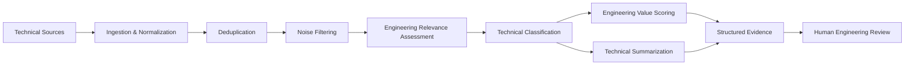

# Human-in-the-Loop Engineering Technology Intelligence

An n8n-based demonstrator for turning high-volume, heterogeneous technical information into **structured evidence for engineering review and R&D decision support**.

The project explores a practical question:

> **How can LLMs reduce information overload in engineering R&D without removing human engineering judgement from the decision loop?**

Rather than treating AI as an autonomous decision-maker, the workflow uses LLMs to support information filtering, classification, evaluation and summarization while preserving source traceability and human review.

---

## System overview



**Core pipeline:**  
`Sources → Normalize → Deduplicate → Filter → Classify → Evaluate → Summarize → Human Review`

The public workflow uses synthetic inputs. The production-inspired implementation connects multiple information sources, LLM processing stages and structured downstream storage.

---

## Why this project

Engineering R&D teams often face more technical information than an individual engineer can review consistently. The challenge is not simply summarization.

Before information can support an engineering decision, it must be:

- screened for relevance;
- separated from promotional or administrative noise;
- categorized into technical domains;
- evaluated using explicit engineering criteria;
- summarized without introducing unsupported claims;
- kept traceable to the original source;
- reviewed by a human engineer before downstream use.

This workflow was developed as a practical exploration of that information-to-decision chain.

---

## What the workflow does

### 1. Ingestion and preprocessing

Incoming technical items are normalized into a common structure containing title, source, publication time, content and original link.

The workflow then performs time filtering and duplicate detection before invoking LLM-based processing.

### 2. Noise and relevance filtering

Two separate stages reduce information overload:

- **Noise filtering** removes promotional, administrative and low-information items.
- **Engineering relevance assessment** determines whether an item contains meaningful automotive powertrain technology information.

Keeping these stages separate avoids treating every industry-related item as technically relevant.

### 3. Technical classification

Relevant information is organized into engineering domains such as:

- electric motors and power electronics;
- batteries;
- internal combustion engines;
- integrated drive units;
- other technical information.

The classification layer can be replaced with another domain taxonomy without changing the overall architecture.

### 4. Engineering-value assessment

Relevant items are evaluated using explicit criteria such as:

- **innovation** — whether the item presents a new technical route, architecture, product or method;
- **engineering feasibility** — whether the information demonstrates practical engineering relevance or implementation potential.

The resulting score is intended for **prioritization**, not as an autonomous engineering judgement.

### 5. Technical summarization

The workflow produces concise technical summaries while constraining the LLM to the supplied source content.

Important technical entities, performance data and engineering implications are preserved where supported by the original text.

### 6. Human review

The final output is a structured record for engineering review. The engineer remains responsible for verifying the source, interpreting the evidence and deciding whether the information should influence further investigation or engineering work.

---

## Human-in-the-loop design

The system deliberately separates **information processing** from **engineering judgement**.

LLM outputs are treated as intermediate evidence rather than final decisions:

- original title, content and source link remain available for traceability;
- relevance filtering is separated from scoring;
- summarization is constrained to supplied evidence;
- unsupported external verification is not claimed;
- final interpretation and prioritization remain with a human engineer.

This makes the project a small demonstrator of **human-in-the-loop decision support and trustworthy industrial AI**, rather than a fully autonomous agent.

---

## Implementation in n8n

The full implementation is intentionally modular. Conceptually, it can be read as three blocks:

### A. Data preparation

`Source ingestion → normalization → date filtering → deduplication`


### B. AI-assisted technical assessment

`Noise filtering → engineering relevance → technical classification`


### C. Decision-support output

`Engineering-value scoring + technical summarization → structured record → human review`


The actual n8n workflow contains branching and merging logic because classification, scoring and summarization are handled as separate processing paths. The complete public demonstrator is available here:

[`workflow/public-demo.json`](workflow/public-demo.json)

A higher-level architecture description is available in:

[`docs/architecture.md`](docs/architecture.md)

---

## Example

Synthetic examples are included to demonstrate the expected data structure without exposing private industrial information:

- [`examples/sample-input.json`](examples/sample-input.json)
- [`examples/sample-output.json`](examples/sample-output.json)

A simplified conceptual transformation is:

```text
Technical article
      ↓
Relevant to engineering?
      ↓
Technical domain
      ↓
Engineering value + concise evidence summary
      ↓
Engineer reviews original source and AI-assisted output
```

---

## Prompt layer

The public repository separates the main LLM tasks into reusable prompt modules:

- [`prompts/noise-filter.zh.md`](prompts/noise-filter.zh.md)
- [`prompts/powertrain-relevance.zh.md`](prompts/powertrain-relevance.zh.md)
- [`prompts/engineering-value-scoring.zh.md`](prompts/engineering-value-scoring.zh.md)
- [`prompts/technical-summarization.zh.md`](prompts/technical-summarization.zh.md)

The production source corpus is primarily Chinese, so the example prompt templates are currently written in Chinese. The architecture itself is language-agnostic.

---

## Technology

- **n8n** — workflow orchestration
- **LLMs** — relevance assessment, classification, scoring and summarization
- **JavaScript** — normalization, parsing, identifier generation and deduplication logic
- **RSS / API integrations** — source ingestion in the production-inspired architecture
- **Structured data output** — downstream review and knowledge-management workflows

---

## Scope and limitations

This repository is a **demonstrator**, not a validated autonomous engineering system.

LLM outputs can be inconsistent, sensitive to prompt or model changes, and incorrect. A production-grade system for consequential engineering use would require additional measures such as:

- benchmark datasets and quantitative evaluation;
- confidence or uncertainty handling;
- stronger provenance tracking;
- explicit human approval gates;
- access control and audit logging;
- systematic monitoring of model and prompt changes.

These limitations are part of the motivation for exploring trustworthy human-in-the-loop AI in engineering environments.

---

## Repository structure

```text
engineering-tech-intelligence/
├── README.md
├── SECURITY.md
├── workflow/
│   └── public-demo.json
├── prompts/
│   ├── noise-filter.zh.md
│   ├── powertrain-relevance.zh.md
│   ├── engineering-value-scoring.zh.md
│   └── technical-summarization.zh.md
├── examples/
│   ├── sample-input.json
│   └── sample-output.json
└── docs/
    └── architecture.md
```

---

## Publication note

This public repository is a sanitized demonstrator. It contains no company data, supplier data, private source registry, internal database identifiers or credentials.

The production-inspired workflow architecture originally includes private source registries and collaborative database integrations. Those elements are intentionally excluded from the public demonstrator.
