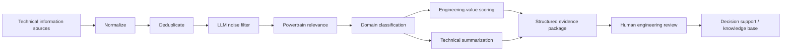

# Architecture

## Design principle

The workflow is deliberately **decision-support**, not autonomous decision-making.  
LLMs reduce information-processing load; engineers retain responsibility for interpretation, verification, prioritization, and downstream decisions.

## Trust controls

- Source text is retained alongside every generated field.
- Summaries are instructed not to add information absent from the source.
- Relevance and noise filtering are separated from engineering-value scoring.
- The public version does not claim external web verification unless an explicit search/retrieval tool is connected.
- Low-information cases should be treated conservatively and escalated to human review.
